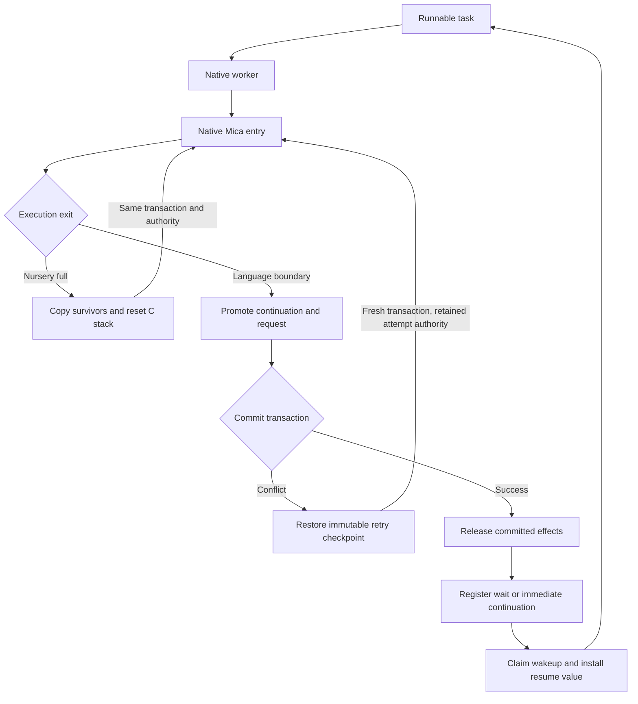

# Native tasks, continuations, and memory management

Status: the generated value layer uses heap nurseries and shared collection. Native task and transaction services remain proposed.
Sections 15.1–15.3 preserve experiment results. Section 15.4 records the current implementation boundary.
Date: 2026-09-30.
Original code baseline: Rust Mica at `28c2e04`.

This document specifies native execution candidates for Mica. The planned compiler
lowers functions and verbs through explicit continuations into native code.
A copying nursery collector moves survivors into a shared, non-moving heap.
A precise, stop-the-world collector reclaims that heap.

Sections 1–12 describe the original stack-nursery candidate and its task protocols.
That historical candidate uses Cheney-on-the-M.T.A. Its comparison implementation is retired.
Experiment 3 selected heap nurseries with required tail calls for runtime development.
Section 13.4 defines that execution mechanism; section 15.3 records its qualification.
The selected model is heap-based CPS, not Cheney-on-the-M.T.A.
The proposed transaction, publication, authority, and retry rules also apply to the selected model.

The native execution endpoint is transactional tasks with suspension,
cross-worker resumption, conflict replay, and bounded reclamation of temporary
objects. General native compilation is part of this endpoint. A generated
bytecode interpreter is not a prerequisite.

Self-hosting requires Mica to generate the compiler backend, runtime, allocator,
collectors, scheduler, authority checks, and transaction implementation.
This ownership requirement applies to every experiment and implementation stage.
Generated programs must not depend on the Rust VM, runtime, relation kernel,
driver, or a Rust service process. Integration with those components is outside
this design.

Rust can execute the Mica generators during bootstrap and orchestrate tests.
It can execute an independent reference implementation for comparison.
It must not supply Mica runtime services to the generated program under test.
External dependencies are libc, operating-system services, libgccjit, and the
selected system toolchain. Mica generates their bindings and any required C wrappers.

The measured results qualify fixed generated fixtures. They do not qualify a
production runtime. Section 17 defines the comparisons required before adoption.

This proposal changes the memory and execution choices in the earlier
`../omica/docs/relational-runtime-bootstrap-design.md`. That document preserves
arenas and excludes collector redesign from its initial scope. This document
defines the additional work explicitly. Rust Mica remains the initial generator
host and the semantic reference for the task behaviours described here. The
earlier bootstrap sequence does not determine this proposal's execution backend.

## 1. Execution mechanism

A native worker executes one Mica task at a time. A task can outlive its worker
assignment and can span many transactions.

Generated execution functions receive an explicit continuation. They transfer
control to another generated function instead of returning through a Mica call
chain on the C stack. The continuation contains the live values and control state
needed for later execution.

Fixed-size records and bounded small payloads occupy the worker's C stack.
Oversized objects use managed heap storage directly. Collection copies nursery
survivors into the shared heap and rewrites their references. The worker then
discards the generated C frames and invokes the relocated continuation.

Heap allocation for survivors and oversized objects does not replace the stack
nursery. Ordinary temporary allocation uses the stack in this candidate.

A language suspension follows a longer path:

1. Materialize the continuation and the boundary request.
2. Promote their reachable nursery objects into the shared heap.
3. Return control to the worker's scheduler through its C landing frame.
4. Commit the task's transaction.
5. On conflict, discard the request and restore the retry checkpoint.
6. On success, publish the effects and register the wait.
7. On wakeup, supply fresh authority, a new transaction, and the resume value.
8. Execute the saved continuation on an available worker.

Promotion changes memory ownership. Commit changes world visibility. The two
operations are separate and have different failure rules.



Baker's design provides the execution pattern: explicit continuations preserve
the computation while collection discards the C stack. It does not require
copying arbitrary C activation records. [Baker, Cheney on the M.T.A.][baker]

This design does not add language-level `call/cc`. Runtime continuations remain
internal execution records. Retry checkpoints support repeated execution of a
transaction segment without exposing general multi-shot continuations.

### 1.1 Independent choices in the stack-nursery control

| Choice | Stack-nursery candidate | Reason and cost |
| --- | --- | --- |
| Execution backend | Native C compilation of Mica functions and verbs | Evaluates native calls and specialization, with compile and load latency |
| Suspended state | Explicit typed continuations | Preserves live values without retaining a native thread or C stack |
| Temporary allocation | Per-worker C stack nursery | Evaluates M.T.A.'s allocation and transfer mechanism, with platform and lifetime constraints |
| Surviving allocation | Shared non-moving heap | Keeps published addresses stable, with fragmentation and promotion costs |
| Shared reclamation | Precise stop-the-world mark-and-sweep | Handles cycles without atomic per-edge counts, with global pauses |
| Runtime services | Mica-generated transactions, authority, and scheduling | Exercises task semantics within the generated runtime |

Explicit continuations fit task resumption and provide immutable replay images.
They do not require either stack allocation or bytecode interpretation. The stack
nursery is the additional hypothesis under evaluation.

A heap nursery is attractive for the existing returning value helpers. It also
avoids platform stack checks. It does not automatically remove the need to capture
live state or limit native call-stack growth. Section 17 compares both allocation
choices under the same native continuation lowering.

Experiment 3 evaluated this M.T.A. candidate and selected heap nurseries with
required tail calls for runtime development. The stack comparison is retired.
The selected model still requires generated task and transaction machinery.

### 1.2 Evidence and its limits

| Evidence | What it supports | What it does not establish |
| --- | --- | --- |
| [Baker's paper][baker] | CPS C functions, explicit live roots, stack allocation, copying, and stack reset | Mica transaction replay or modern compiler correctness for our emitted C |
| [CHICKEN's compilation walkthrough][chicken] | An implemented source-to-C pipeline with CPS, closure conversion, and stack-to-heap evacuation | A speedup over Mica's current execution tiers |
| [Cyclone's collector description][cyclone] | Per-thread stack nurseries with a shared non-moving heap and native threads | Our migrating task protocol or the proposed stop-the-world collector |
| [Current task implementation](../crates/runtime/src/task.rs) | Commit, retry, resume-input capture, and staged effects | Correctness of a native implementation of those rules |
| [Current Mica compiler](../apps/compiler/README.md) | A Mica frontend and emitter for executable register programs | Native lowering, precise GC descriptors, or complete language coverage |

The algorithms below are proposed Mica adaptations. The references establish
mechanisms, not a proof of this combination. Correctness obligations and
acceptance tests accompany each implementation stage.

## 2. Terms and implementation boundaries

| Term | Meaning |
| --- | --- |
| Task | One computation, including nested function and verb calls |
| Segment | Execution between successful transaction boundaries |
| Attempt | One execution of a segment, including a possible failed commit |
| Worker | One native thread with an execution stack and allocation state |
| Continuation | Resume entry plus the live environment and outer control state |
| Retry checkpoint | Immutable segment-entry state used after a conflict |
| Nursery | Worker-local storage whose objects can move during evacuation |
| Shared heap | Managed storage with stable object addresses after promotion |
| Promotion | Copying a reachable nursery graph into shared-heap storage |
| Safepoint | A point where generated code exposes all live managed references |
| Boundary | A language operation that ends the current transaction |
| Landing frame | Live C frame containing the worker's `setjmp` invocation |
| Leaf helper | A returning native function that cannot collect or suspend |

Proposed source responsibilities:

| Path | Responsibility |
| --- | --- |
| `apps/native/` | Typed IR, builders, analyses, descriptors, and generated backend definitions |
| `apps/native/value/` | Value layout, operations, tracing, and relocation descriptions |
| `apps/native/memory/` | Managed allocation, collection, roots, publication, and worker coordination |
| `apps/runtime/` | Proposed execution, task, transaction, and scheduler descriptions |
| `apps/compiler/` | Existing Mica compiler, plus native CPS and closure lowering |
| `apps/native/*/platform.mica` | Definitions that generate bindings for thread primitives, mappings, clocks, and foreign entry points |
| `crates/testing/` | Generator execution, test orchestration, and independent semantic and performance comparisons |
| `target/native-gccjit/` | Generated C, executables, and disposable measurement output |

These paths assign responsibilities. They do not claim that the proposed modules
exist. Current execution coverage lives in `apps/native/tests/execution.mica` and uses the managed heap.
The `apps/runtime/` modules and general native source lowering remain proposed.
Mica-generated code owns execution, collection, tasks, transactions, authority,
message delivery, and scheduling from their first implementation.

The platform bindings expose operating-system, ABI, and compiler mechanisms.
They do not implement Mica scheduling policy, transaction rules, or collection
algorithms. Those algorithms use the native IR and its builders.

## 3. Current foundations and required generated components

The Rust sources provide semantic references and independent test oracles.
The required work belongs in Mica-generated components. This design does not
add a native execution backend to the existing Rust runtime or driver.

| Current foundation | What exists | Required generated work |
| --- | --- | --- |
| [Task runtime](../crates/runtime/src/task.rs) | Transaction attempts, buffered effects, retry checkpoints, and outcomes | Implement task semantics with managed continuation records |
| [Task manager](../crates/runtime/src/task_manager.rs) | Suspended task ownership and explicit resume authority | Implement task ownership, wake claims, and worker-independent resume records |
| [VM](../crates/vm/src/vm.rs) | Register frames, captures, handlers, resume destinations, and native acceleration | Use as a semantic reference for native continuation lowering |
| [Driver](../crates/driver/src/pool.rs) | Compio dispatch, waits, cancellation, and host integration | Implement a generated scheduler and event processing over OS thread and I/O primitives |
| [CPU admission](../crates/driver/src/execution.rs) | Coordination of task execution and parallel relation work | Implement bounded admission across both forms of work |
| [Transaction kernel](../crates/relation-kernel/src/transaction.rs) | Snapshot reads, overlays, conflict checks, and publication | Implement transactions over native values, with traced snapshots, overlays, and published roots |
| [Native contracts](../apps/native/contracts.mica) and [execution IR](../apps/native/execution.mica) | Effects, pointer provenance, explicit roots, relocation checks, and execution transfers | Apply these contracts to general source lowering and generated task services |
| [Native memory](../apps/native/memory/program.mica) | Worker heap nurseries, promotion, shared collection, and publication | Apply root and safepoint rules to generated runtime services |
| [Native values](../apps/native/value/program.mica) | Tagged values, layout descriptors, and relocation of pointer fields | Use these values in generated relation and task services |
| [Native copying](../apps/native/value/copy.mica) | Explicit value copying into another managed heap | Keep semantic copying separate from collector promotion |
| [Native symbols](../apps/native/value/symbols.mica) | Synchronized interning and pinned table-owned text | Preserve table lifetime and synchronization in the generated runtime |

Relocation checks cover explicit managed provenance. They do not prove descriptor
completeness or discover pointers hidden in untracked storage. An arena borrow
annotation is not a GC root declaration.

The Rust VM already has Cranelift acceleration. A generated C backend cannot
claim a native-versus-interpreter advantage without naming the execution tier
used for comparison.

The compiler is already written in Mica. This work adds native lowering and
runtime support. It does not port a compiler from Rust into Mica.

Current compiler coverage is a separate constraint. Its README identifies
unsupported language forms and analysis. The native prototype must declare its
supported subset and reject unsupported programs before installation. It cannot
claim full language parity through a silent interpreter fallback.

## 4. Semantic contract

The current [task and transaction model](../mdbook/src/runtime/tasks-and-transactions.md)
and [task-control rules](../mdbook/src/runtime/task-control.md) define the baseline.
This proposal does not resolve other Rust/Odin conformance differences.

| Event | Transaction | Execution and effects |
| --- | --- | --- |
| Ordinary function or verb call | Same transaction | Same task, authority, and effect buffers |
| Nursery evacuation | Unchanged | Relocate values and continue without publishing effects |
| Major GC pause | Unchanged | Park workers and preserve all task state |
| Source `commit()` | Commit | Schedule continuation with a fresh transaction and authority |
| `suspend`, `read`, mailbox receive, external request | Commit before wait | Save locals and control state, then await a result |
| `spawn` | Parent commits first | Submit child, then resume parent with the task ID |
| Normal completion | Commit | Publish result and effects after success |
| Retryable conflict | Discard failed attempt | Restore segment entry and execute it against a fresh transaction |
| Handled language error | Unchanged | Execute handlers within the same draft |
| Unhandled language error | Abort current attempt | Discard its effects and return the error |
| Cancellation of a suspended task | No active segment | Discard continuation without executing `finally` |

The current VM also has an internal `Commit` response that continues within the
runtime loop. Source `commit()` uses the suspending `CommitValue` path. These are
reference behaviours, not a requirement to execute bytecode in the native backend.
Any native entry corresponding to an internal commit must preserve its transaction
and authority renewal rules.

Additional constraints:

- Resume input becomes part of the next retry checkpoint. Replay cannot receive
  the same mailbox messages or request the same host input again.
- Automatic conflict retry currently excludes attempts with tagged buffer
  applies. The native runtime must retain that predicate.
- Retry currently renews the transaction while retaining the attempt's authority
  context. Scheduled language resumption obtains explicitly supplied fresh authority.
- Mailbox sends and subscription operations remain staged until successful commit.
- Mailbox creation and closure manage immediate ephemeral resources. Abort does
  not reverse them. The native implementation must preserve this exception.
- Query result values remain immutable across suspension. They do not become
  live queries against the resumed transaction.
- A spawned child resolves its method when it runs. Capturing its arguments does
  not bind the method implementation early or change the parent's principal.
- Strict and relaxed persistence retain their existing publication ordering.
  Promotion into the process heap does not make a value durable.
- Instruction budgets, call-depth limits, and retry limits remain observable
  runtime controls. GC and scheduler maintenance cannot replenish them.

GC tracing proves memory reachability. It does not prove authority validity.
An expired capability can remain reachable without becoming usable again.

## 5. Runtime records

The following records are conceptual schemas, not a promised binary layout.

| Record | Fields and ownership |
| --- | --- |
| `TaskControl` | Task ID, lifecycle state, wake generation, context identity, limits, retry count, and roots |
| `TaskImage` | Native entry, immutable environment, arguments, handlers, and code references |
| `RetryImage` | Immutable segment-entry image, including delivered input |
| `Attempt` | Active transaction, effective authority, speculative effects, sends, subscriptions, and scratch roots |
| `Continuation` | Code reference, outer continuation, handler reference, logical depth, and typed captures |
| `BoundaryRequest` | Boundary kind, promoted request payload, post-operation continuation, and reserved delivery storage |
| `Worker` | Native thread identity, stack limits, jump buffer, promotion reserve, roots, allocator caches, and GC epoch |
| `ExecutionContext` | Current worker and attempt pointers, operation budget, and exit storage |

`TaskControl` and published images live outside worker stacks. A running worker
has exclusive ownership of the task's mutable execution state. Other threads
can request cancellation or deliver events through synchronized control fields.
They cannot inspect partially initialized frames.

The compiler must not capture `Worker*`, a jump buffer, a live transaction pointer,
or an authority-cache pointer in a continuation. These belong to the current
execution context. Resume code receives the appropriate context explicitly.

Continuations and retry images are immutable after publication. Mutable locals
occupy registers or task-private working frames. Capturing them creates a new
immutable image. Reusing a captured mutable frame corrupts rollback.

### 5.1 Task states and wakeup races

The scheduler owns these logical states:

```text
Runnable -> Running -> PreparingBoundary -> Committing
Committing -> Running                 conflict retry
Committing -> Waiting                 successful wait
Committing -> Runnable                successful immediate continuation
Committing -> Completed               successful terminal commit
Waiting -> Runnable                   accepted wakeup
Waiting -> Cancelled                  accepted cancellation
Running -> Aborted                    unhandled error or runtime failure
```

Collection states belong to workers and overlay this state machine. They do not
create language task states or transaction boundaries.

A task-state lock or compare-and-exchange operation claims each wakeup. The claim
includes a generation number. A late timer or host callback for an earlier wait
cannot resume the task again. Queue insertion transfers one execution claim.

Wait registration must close the readiness race. For mailbox receive, registration
and the second readiness check occur under the mailbox protocol's synchronization.
A message arriving between commit and registration must remain observable.

The commit path and cancellation path also require an explicit winner. Cancellation
cannot undo an already published transaction. A cancellation that wins before
publication prevents that attempt from publishing. After publication, cleanup
must preserve the committed outcome and release any unneeded continuation.
This running-task arbitration is proposed behaviour that needs separate tests.

### 5.2 Invariants required at every execution exit

1. Every future managed reference is reachable through the published resume packet or registered attempt roots.
2. Published roots contain no pointer into a worker's C stack.
3. A retry image and its captured values remain unchanged throughout the attempt.
4. A saved image contains no worker, transaction, jump-buffer, or authority-cache pointer.
5. Exactly one worker owns each running task.
6. A successful commit can never become an automatic conflict retry.
7. Collection and internal scheduling do not commit or refresh authority.

An execution exit means stack reset, language suspension, completion, or failure.
Ordinary C locals can hold managed references between exits. At an exit, liveness
analysis must place every future reference in the explicit root graph. The
collector never discovers live values by inspecting arbitrary C frames.

## 6. Generated C execution conventions

### 6.1 Two function classes

Generated code distinguishes execution functions from leaf helpers.

| Class | Can return? | Can allocate? | Can collect or suspend? |
| --- | --- | --- | --- |
| Execution function | No ordinary return to its caller | Yes, under managed allocation rules | Yes, at explicit safepoints |
| Leaf helper | Yes | Into caller-owned reserved storage or reserved mature storage | No |

A third category, the host boundary, always returns normally to the C execution
layer before any stack reset. Host callbacks cannot secretly enter non-returning
Mica execution.

An execution entry receives an execution context, a closure or environment, and
typed arguments. Known calls can use specialized C signatures. Indirect calls
use a common argument packet and a signature-specific wrapper.

An illustrative common entry type is:

```c
typedef void (*MicaEntry)(MicaExecution *execution,
                         MicaClosure *closure,
                         MicaArguments *arguments);
```

The generator checks that execution entries never return. C's function-pointer
type alone does not express that rule. Returning through an indirect execution
entry reaches a fatal internal-error path.

### 6.2 Lowering a nested call

Consider this Mica body:

```mica
let first = compute(input)
let message = read(:line)
return combine(first, message)
```

The compiler produces continuation entries for the required resume points:

```text
entry(input, outer):
    next = AfterCompute { outer }
    transfer compute(input, next)

after_compute(first, captured):
    next = AfterRead { outer: captured.outer, first }
    request read(:line, next)

after_read(message, captured):
    transfer combine(captured.first, message, captured.outer)
```

`AfterRead` retains `first` and the outer continuation. It does not retain the
previous worker or transaction. Its descriptor identifies every managed field.

The allocating C frame must stay active until transfer or evacuation. A stack
continuation cannot escape from an ordinary returning constructor helper.
The emitter constructs such records at their execution call sites.

For example, the middle and final entries have this general C shape. The types,
layout identifiers, and runtime calls are illustrative proposed interfaces.

```c
typedef struct {
    MicaContinuation base;
    MicaValue first;
} MicaAfterRead;

_Noreturn void mica_after_compute(MicaExecution *execution,
                                 MicaContinuation *outer,
                                 MicaValue first) {
    /* The caller established stack headroom before entering this frame. */
    MicaAfterRead next = {
        .base = {
            .header = MICA_HEADER(MICA_LAYOUT_AFTER_READ),
            .code = MICA_CODE_AFTER_READ,
            .outer = outer
        },
        .first = first
    };

    /* Materialize all roots, evacuate, and exit to boundary processing. */
    mica_request_read(execution, MICA_SYMBOL_LINE, &next.base);
}

_Noreturn void mica_after_read(MicaExecution *execution,
                              const MicaAfterRead *saved,
                              MicaValue message) {
    mica_call_combine(execution, saved->first, message, saved->base.outer);
}
```

Both runtime calls have non-returning execution contracts. The descriptor traces
`base.outer` and `first`, and retains the code owner referenced by `base.code`.
The record contains no pointer to `execution`. After resumption, the receiving
worker supplies that argument.

### 6.3 Stack reset and the landing frame

The C landing frame contains `setjmp` directly. A helper cannot call `setjmp`
and return its jump buffer to a caller. The saved invocation must remain active.

The worker's exit packet lives in stable, registered storage. Before a jump,
generated code relocates the complete live graph, including that packet and
registered attempt roots. Every old C local becomes dead after transfer. Resume
code reads relocated fields instead of continuing with stale local copies.

```c
/* Illustrative control structure. Runtime types and operations are proposed. */
MicaWorkerResult mica_run_worker_slice(MicaWorker *worker) {
    for (;;) {
        if (setjmp(worker->landing) == 0) {
            mica_enter_execution(worker);  /* Does not return. */
            abort();
        }

        /* Stack references are gone. The exit packet remains rooted. */
        mica_finish_reset(worker);
        mica_service_gc_request(worker);
        if (worker->exit.kind == MICA_REENTER) {
            continue;  /* Same attempt, authority, and remaining budget. */
        }
        return mica_export_worker_exit(worker);
    }
}
```

The jump stays inside generated C frames owned by this invocation. It never
crosses foreign frames, live locks, or foreign cleanup scopes. The generated
scheduler receives an ordinary C return and processes the outcome.

Modified non-volatile automatic variables can become indeterminate after
`longjmp`. Mutable exit state therefore lives in `Worker`, rather than landing-frame
locals. Cross-thread jumps and jumps into exited frames are invalid.
[Linux/POSIX `setjmp` and `longjmp`][setjmp]

Worker migration invokes a saved entry on a different thread. It never transfers
or reuses the original thread's jump buffer.

Errors use explicit handler continuations. Language returns invoke the caller's
continuation. Neither operation unwinds the C stack. `longjmp` only discards a
stack whose useful state already exists in the managed root graph.

### 6.4 C lifetime and stack-space rules

Fixed-size nursery objects use automatic C storage at execution call sites.
Bounded variable payloads use a checked stack-allocation intrinsic at the same
sites. Oversized requests use mature allocation. The stack intrinsic is an
explicit compiler extension, not a claim of strict ISO C portability.

The allocation operation checks size arithmetic, alignment, stack headroom, and
promotion capacity before allocation. It cannot be a returning function that
allocates on its own stack. Its emitted scope must remain live through transfer.
GCC documents different lifetimes for its stack-allocation builtins. The platform
implementation must use the matching lifetime contract. [GCC stack allocation][gcc-stack]

The existing [scope placement pass](../apps/native/c_scopes.mica) needs an
allocation-lifetime constraint. A nursery object cannot leave its C scope while
a continuation still refers to it. Ordinary temporary scalars can retain narrow
scopes. Managed stack objects remain in the enclosing execution frame through
the final transfer.

An allocating loop cannot repeatedly overwrite one automatic object while
earlier iterations retain references to it. The initial lowering uses a fresh
execution activation for each retained allocation iteration. Allocation-free
loops remain ordinary C loops, with polls on their backedges.

A local compiler optimization can remove a continuation whose state never escapes.
It cannot turn an allocating transfer cycle into a loop that overwrites retained
objects. Dead C frames consume nursery space until reset, even after a language return.

Stack checks require compiler and platform support:

- The platform supplies stack bounds and a reserved emergency region.
- The compiler measures or bounds generated frame sizes for supported builds.
- Call sites reserve enough space for the callee's prologue and its next poll.
- Generated code polls before unbounded call growth and on long loop backedges.
- Foreign calls require their own stack allowance and cannot trigger a hidden reset.

A check at function entry alone cannot protect an arbitrarily large prologue.
A guard-page fault is a failure detector, not the normal collection mechanism.
Compiler flags and optimization levels form part of the supported execution ABI.

The first platform target is Linux AArch64 with a pinned GCC toolchain. The build
disables cross-entry inlining and LTO until their stack behaviour is validated.
It emits per-function stack reports and rejects unaccounted dynamic stack growth.
GCC distinguishes static, bounded dynamic, and unbounded dynamic reports.
[GCC stack-usage reporting][gcc-stack-usage]

The transfer check reserves the largest permitted next-entry prologue plus the
collector's emergency requirement. Each runtime helper has a checked maximum
stack requirement or executes outside the nursery slice. Small-stack stress tests
validate the build, but do not replace these bounds. Clang and other architectures
need separate qualification before they become supported targets.

## 7. Generator and IR changes

The generator must retain enough information to prove collection safety before
it emits C. Comments and C type names alone cannot establish these properties.

Proposed facts extend the existing relational construction model:

| Fact or annotation | Purpose |
| --- | --- |
| Function execution class | Distinguish returning helpers, execution entries, and foreign boundaries |
| `MayCollect`, `MaySuspend`, `MayPublish` effects | Propagate execution hazards through call edges |
| Allocation region | Distinguish nursery, mature, pinned foreign, and unmanaged storage |
| Managed object layout | Define size, alignment, initialization state, and tracing rules |
| Managed field kind | Tagged value, managed base pointer, base-plus-offset view, scalar, or code reference |
| Safepoint live set | Identify live values, handler state, arguments, and continuations |
| Resume entry | Associate a code reference and source location with a continuation layout |
| Capture list | Define typed continuation fields and their initialization order |
| Root region | Describe worker-private slots that can contain nursery references |
| Stack lifetime | Prevent C scope placement from shortening a managed object's lifetime |
| Allocation plan | Bound storage, initialization, and promotion reserve before a no-GC helper call |
| Logical operation cost | Preserve budget charges independently of native instruction counts |
| Transfer terminator | End execution without an ordinary C return |

The current `Allocate` effect does not imply collection. The additional effects
must distinguish storage reservation from an operation that can move objects.
Dynamic calls conservatively inherit collection and suspension effects unless
their target set proves otherwise.

The lowering pipeline becomes:

1. Resolve calls, available type information, effects, and ownership.
2. Normalize evaluation order and preserve source identities and logical operation costs.
3. Identify transfers, polls, and handler transitions, then compute their live values.
4. Convert calls to CPS and construct closure, continuation, and root layouts.
5. Lower transfers, allocation plans, and boundary requests into native IR.
6. Validate pointer escape and initialization rules.
7. Structure C control flow and place locals within lifetime constraints.
8. Emit code, descriptors, source locations, and code-retention metadata.

Named builders must construct these forms. Runtime descriptions must not resume
manual assembly of positional syntax lists. Existing dependency ordering and
structured C emission remain applicable inside execution functions.

Required static rejections include:

- A nursery pointer stored in published storage without promotion.
- A pointer hidden in an unclassified integer or opaque field.
- An interior pointer crossing a safepoint without its base and offset.
- A returning helper that allocates an escaping object on its C stack.
- A collection edge while a foreign borrow or runtime lock is active.
- A continuation capture of worker-local authority or transaction state.
- A partial object exposed through a root whose descriptor scans uninitialized fields.

## 8. Memory management

### 8.1 Storage classes

| Storage | Address and lifetime rules |
| --- | --- |
| Immediate value | Existing scalar payload with no managed address |
| Stack nursery object | Address valid until evacuation and stack reset |
| Mature object | Address stable until tracing proves it unreachable |
| Worker root region | Private mutable slots, scanned precisely before evacuation |
| Foreign or pinned resource | Explicit host ownership and registered managed edges |
| Persistent encoding | Bytes independent of process pointers and collector metadata |

Tagged values continue to contain direct addresses. This design does not require
a handle lookup on every value access. The current high-byte tag and 56-bit
payload remain subject to the existing pointer encoding checks. Unsupported
addresses fail validation rather than losing high bits silently.

Relocation cannot change value equality, ordering, or hashing. Content hashes
remain valid after movement. Function and capability identities retain their
registry identities. Address-based caches must relocate their keys or invalidate
their entries before execution resumes.

Mature storage is shared as an address space. Promotion does not make every
object visible to other tasks. Transaction drafts and prepared boundary requests
can remain private while their memory resides in that heap.

### 8.2 Object descriptors and headers

Every managed allocation has a collector header or equivalent side metadata.
The initial design uses a uniform header before the payload, with correct payload
alignment. Tagged pointers identify the payload base.

The metadata contains a layout identifier, allocation extent, generation or
space classification, and collection state. Nursery metadata also supports a
forwarding address. Mature marking can use side bitmaps to avoid modifying
immutable language payloads.

Generated descriptors provide:

- Object size and alignment, including variable-length payload rules.
- A visitor for tagged values and managed base pointers.
- Relocation rules for embedded records and views.
- Code references that retain their native modules.
- Initialized-element counts for partially constructed arrays.
- Explicit treatment of foreign resources and pinned backing storage.

Tracing must distinguish managed references from arbitrary U64 fields. Capability
and function IDs need registry-root rules even when their value tags contain no
pointer. Identity integers do not become addresses because their bits resemble one.

Collector copies preserve valid C object representations and alignment. Generated
typed relocation routines avoid relying on incompatible pointer casts to scan
arbitrary structs. Padding bytes never determine equality or GC reachability.

### 8.3 Strings, slices, and shared backing

Current strings and collections contain raw data pointers and shared backing
references. A collector cannot relocate those fields as unrelated allocations.

The proposed managed representation uses a backing object reference,
an offset, and a length. Generated code computes a raw data pointer inside a
region that cannot collect. After a safepoint, it computes that pointer again.

For an inline payload, the descriptor identifies the containing allocation and
the payload offset. For a shared slice, promotion preserves the shared backing
object. Two slices must not become two unrelated full copies of the backing data.

The same rule covers tuple arrays, relation columns, map entries, list storage,
and UTF-8 indexes. The existing explicit value-copy operation is not automatically
a suitable collector: evacuation must preserve sharing and handle cycles.

### 8.4 Returning helpers and allocation

Existing value operations mostly use ordinary C call/return. Converting every
small helper to CPS immediately is unnecessary, but their allocation contract
must change coherently.

For a bounded constructor, the caller computes an allocation plan and reserves
storage in its own execution activation. A returning helper initializes that
storage without collection. The caller then transfers with the completed object
in its root graph. For example, concatenation plans its byte length before the
caller reserves the string header and payload.

The constructor API therefore changes from arena allocation to caller-provided
storage or resumable construction. Substituting `alloca` inside today's returning
allocator is invalid. The constructor's result must outlive that helper call.

If a helper exceeds its reservation, it returns an internal allocation status
before any externally visible action. Retrying that helper requires a proof that
the operation is restartable. Language calls and host effects cannot be retried
merely because they returned an allocation status.

Large or unbounded operations require resumable execution entries or direct
mature allocation with explicit roots. They cannot bypass budgets or hold a
collection prohibition indefinitely. Examples include graph copying, sorting,
and large codec operations.

Pointer-bearing mature construction first promotes its inputs. Construction uses
registered, initialized slots and cannot install a nursery edge. Byte-only large
objects avoid that promotion when their initializer cannot collect. Unfinished
objects remain private and carry an initialized-field count for tracing.

The graph copier, collector, and allocator use iterative worklists. An unbounded
recursive C helper cannot consume the emergency stack reserved for collection.

### 8.5 Publication and pointer stores

The initial invariant is strict: **a mature managed object cannot contain a
reference to a worker nursery**. A shared queue can never contain such a reference.

Construction of nursery graphs is unrestricted within one worker. Before a
reference enters mature storage, the runtime evacuates the live nursery as
specified in section 9. Private worker root regions are the explicit exception:
their registered slots can point into the nursery until evacuation.

Root regions are runtime-owned slot arrays, not arbitrary heap objects exempt
from tracing. Their owner registers them before any managed store. Resizing
replaces the registered address while the owner holds the execution claim. The
minor collector rewrites their slots. Reset unregisters or clears every obsolete region.

This rule avoids a general mature-to-nursery remembered set initially. Its cost
is earlier promotion on some stores. A later remembered-set design needs its own
multicore proof and measurements. It cannot permit cross-worker stack references.

Immutable language values make this restriction practical. Internal builders
must remain private until sealed. An optimization that mutates supposedly unique
backing storage must account for aliases held by retry checkpoints and continuations.

Cross-worker publication uses a queue or lock with release/acquire ordering.
Initialization and relocation finish before publication. Stable addresses alone
do not make mutable fields safe for concurrent access.

### 8.6 Page allocation and operating-system reclamation

The shared allocator obtains pages in batches. Worker allocation caches reduce
contention but remain enumerable by the collector. The collector owns object
liveness independently of page allocation.

Heap pages can use `mmap`. The runtime can discard excess, wholly unused page
ranges after bursts. It cannot discard a page that still contains one live or
pinned allocation. Normal nursery reset restores the C stack through the landing
frame. It does not invoke a syscall for each temporary allocation.

For private anonymous mappings, `MADV_DONTNEED` discards contents while retaining
the virtual mapping. Reuse incurs demand-zero work. `MADV_FREE` permits deferred
reclamation, and writes before reclamation cancel it for those pages.
[Linux `madvise` semantics][madvise]

Thresholds come from measurements of discard and subsequent reuse. Timing the
syscall alone misses page faults and zero-fill costs. The initial implementation
does not apply page advice to live C stack ranges.

## 9. Nursery collection

There are two related operations:

- **Promotion without reset** copies a selected graph before a store or publication.
- **Full evacuation** promotes every live nursery root before discarding the execution stack and chunks.

Promotion without reset leaves the original nursery objects intact. Generated
accessors must resolve an existing forwarding record before reading such an
object, or the operation must replace all live aliases at a safepoint. The initial
implementation chooses the latter: graph promotion is a safepoint, with complete
root relocation and immediate stack reset. There is no forwarding check on the
ordinary value-access path.

As a result, a mature store that requires promotion becomes an execution split.
Its continuation describes the pending store. After evacuation, that continuation
performs the store using mature references. Grouping stores before this split can
amortize promotion without changing the invariant.

Batching cannot reorder a relation write past a query that must observe it. A
relation-heavy workload can therefore force frequent evacuation under this rule.
That cost belongs in the initial benchmark, rather than in an assumed future optimization.

### 9.1 Root inventory

A worker exposes all these roots before evacuation:

- Current execution entry, arguments, closure, and continuation chain.
- Native captures, handler state, and current operation arguments.
- Native values retained by the attempt and any registered private builders.
- Pending effects, mailbox sends, subscription operations, and boundary payloads.
- Private builder state and registered native scratch slots.
- Any result or error that must survive an execution exit.

Retry images and previously published values already contain only mature
references. Their roots remain registered for major collection.

The generated transaction implementation registers its private overlays and
scratch slots with the collector. Every retained nursery reference must occupy
a registered slot that evacuation can rewrite. Published state contains only
mature references. Section 14 defines the separate foreign-resource boundary.

### 9.2 Evacuation algorithm

1. Publish the exact worker root set to the local evacuation operation.
2. Reserve destination storage, forwarding metadata, and the scan worklist.
3. For each nursery reference, allocate a destination on first encounter.
4. Record forwarding before visiting child references.
5. Copy the payload and enqueue its descriptor for scanning.
6. Rewrite the referring slot to the destination, preserving the value tag.
7. Scan queued objects and relocate their child references.
8. Rebuild interior views from relocated bases and offsets.
9. Validate that every escaping root is nursery-free.
10. Publish the stable exit packet and jump to the landing frame.

Recording forwarding before child traversal preserves sharing and terminates on
cycles. The scan worklist holds references to destination objects. Source objects
remain valid until evacuation completes.

Forwarding belongs in a typed header field. The copier does not overwrite a
payload with a differently typed pointer. Every managed tag has a relocation
routine, including the repacking of tagged addresses. The compiler emits typed
field updates rather than aliasing arbitrary fields through `void **`.

In production, evacuation cannot fail after the stack becomes disposable. Each
nursery epoch therefore reserves enough promotion capacity for its maximum live
payload, metadata, and worklist. Exhaustion triggers collection before entering
the next epoch. Oversized objects bypass the bounded nursery.

If replenishment fails, the runtime uses a preallocated failure path. It retains
the last valid checkpoint and any already committed output while aborting the
current attempt. It must never expose a partially relocated continuation.

Reserve size includes collector headers and alignment overhead. A reserve of only
the language payload bytes is insufficient.

Each stack allocation charges both bytes and an object count against the epoch's
reserve. Those counters bound destination storage and worklist entries, including
continuation records. The collector consumes dedicated capacity that ordinary
mature allocation cannot consume. Forwarding requires no separate hash-table growth.

After reset, the worker replenishes that reserve before re-entry. A major GC can
run at this point because every worker can evacuate using its existing reserve.
This ordering avoids requiring free shared-heap space to reach the GC safepoint.
Allocator-level reservation does not prevent an operating system from terminating
the process under system-wide memory exhaustion.

The worker can identify nursery membership through its supported stack
address ranges, followed by descriptor validation. Stack-address arithmetic lives
in the platform shim. The collector never dereferences an arbitrary integer to
discover whether it looks like an object.

Partially copied destinations remain private construction objects until their
fields are relocated. Major collection cannot scan them concurrently. Workers
acknowledge the global pause only after finishing evacuation and publishing roots.

Promotion reserves have a measurable memory cost. Total reserve grows with worker
count and nursery limits. The benchmark must include this storage in its memory
accounting, even when the operating system supplies its pages lazily.

## 10. Shared-heap garbage collection

### 10.1 Initial collector

The proposed first shared collector is **precise, non-moving, stop-the-world
mark-and-sweep**, used by multiple native workers. Only collection pauses the
workers. Normal task execution remains parallel.

This choice avoids shared relocation barriers and handles cycles directly. It
also avoids per-edge atomic reference-count updates. It trades those costs for
global collection pauses and exact root enumeration.

Reference counting remains an alternative, rather than a simultaneous ownership
scheme for the same objects. It needs a specified cycle strategy and safe
cross-thread retain/release operations. An atomic increment cannot safely acquire
a reference to an object that another thread already freed.

Cyclone demonstrates the broader combination of per-thread M.T.A. nurseries and
a shared non-moving collector. Its major collector runs concurrently and uses
additional synchronization. This proposal starts with a simpler global pause.
[Cyclone collector design][cyclone]

### 10.2 Major roots

Major collection traces native references in:

- Running, runnable, suspended, and retained terminal task records.
- Every retry image and prepared boundary request.
- Registered native values held by transactions and foreign root handles.
- Mailbox queues, timers, subscription delivery buffers, and host request results.
- Program constants, closures, code modules, and dispatch caches.
- Symbol storage and other process-lifetime registries.
- Explicit foreign roots and kernel-owned native containers.

Snapshot release and managed-object collection are separate operations. A snapshot
pin retains its reachable values through registered roots until release.
The generated transaction implementation exposes world, snapshot, index, and
overlay roots from its first implementation. Raw native pointers inside external
containers require registered visitors or explicit root handles.

The initial design uses strong symbol roots and retains their current process
lifetime. Weak interning is a separate policy change.

### 10.3 Stop-the-world protocol

1. A coordinator increments the requested collection epoch.
2. Each worker polls at a bounded safepoint and evacuates its nursery.
3. Each worker publishes mature roots and acknowledges that epoch.
4. The coordinator waits for all heap participants to acknowledge or declare a safe foreign state.
5. The collector marks from the stable root registry and traces object descriptors.
6. The collector sweeps unmarked objects and returns empty pages to allocator caches.
7. The coordinator releases the workers.

Promotion reserves prevent the evacuation phase from recursively requiring major
collection. The coordinator does not mark while other workers still publish
roots or modify managed containers.

GC participation includes scheduler and host threads that manipulate managed
references. They must use root-registration and pause protocols, or exchange
copied foreign data with the runtime. Pausing only execution workers is insufficient.

Root insertion, removal, and participant registration use the same collection
epoch protocol. A thread cannot register a root after the collector captures its
root set while assuming that the object remains protected. A foreign participant
in a safe state can operate on copied data, but cannot modify managed roots.

A worker cannot acknowledge a pause while holding a lock required by root
enumeration or sweeping. Blocking host operations first publish stable roots and
leave the managed-heap access protocol. On return, they re-enter before touching
managed memory. An uncooperative callback cannot count as safely parked.

### 10.4 Concurrent collection as a later decision

If pause measurements reject the initial collector, the same object descriptors
can support a concurrent non-moving collector. That extension needs allocation
colour rules, barriers for root and heap mutations, safe queue traversal, and
deferred reclamation of removed roots.

Immutability reduces heap mutation but does not remove concurrent-GC barriers.
Task roots, mailboxes, registries, and transaction roots still change. Concurrent
collection is not implemented by replacing one global lock with atomics.

### 10.5 Resource cleanup

GC frees memory. It does not commit transactions, close language mailboxes, execute
`finally`, or deliver pending effects. Those operations belong to task and host
lifecycle protocols.

Collector-triggered foreign cleanup is limited to nonblocking resource release
with no Mica re-entry. More complex cleanup enters an explicit host work queue.
Cancellation must release root ownership even when language cleanup does not run.

## 11. Transaction boundaries and replay

### 11.1 Two execution images

A running task has two distinct logical roots:

```text
retry image:   state at segment entry, after installing any resume input
current image: state at the next poll, call, error, or boundary
```

Only the current image advances during an attempt. A conflict discards that image
and restores a fresh working copy of the retry image. Immutable values can remain
shared. Mutable register windows and builder state cannot alias the checkpoint.

For native execution, the checkpoint is a resume entry with an immutable
environment and arguments. Starting an attempt creates new mutable working
storage. Execution never consumes or mutates the checkpoint's environment.

Captures include loop accumulators, exception handlers, pending `finally` state,
and the value supplied at resumption. A scalar variable becomes a copied field.
A captured collection can share immutable storage. Unique-owner mutation
optimizations must treat the checkpoint as a real alias.

The runtime does not rewind the allocator to undo a transaction. Speculative
objects become unreachable and collection reclaims them. Objects reachable from
earlier committed roots remain valid.

### 11.2 Prepare before committing

Before attempting a boundary commit, the runtime must have:

- A stable continuation or terminal result.
- Stable request, effect, send, and subscription payloads.
- Reserved storage for the scheduler transition and outcome delivery.
- Roots that protect both the current image and the existing retry image.
- No live foreign borrow, native lock, or worker-stack dependency in the request.

Preparation can allocate and fail. It occurs before irreversible publication.
After commit succeeds, a GC allocation failure cannot turn the outcome into an
automatic retry. That duplicates committed work.

The generated commit operation implements the specified conflict and publication
rules for its declared transaction subset. General durability support must
preserve the ordering in section 4. A prototype without persistence must state
that limitation.
On a retryable conflict, the runtime discards the prepared request without delivery.
On success, the runtime transfers its prepared state to the scheduler and releases
effects in the required order.

The generated commit path records one of three distinct dispositions:

| Disposition | Native task action |
| --- | --- |
| Not committed, retryable conflict | Discard prepared state and restore the retry image |
| Not committed, terminal failure | Abort the attempt and release speculative roots |
| Committed, with success or delivery failure | Preserve the published outcome and never replay this segment |

The reference runtime can report a subscription error after publication.
The generated implementation must preserve the committed disposition through
any subsequent delivery or registration failure. Its task state records that
disposition before delivery starts. It never infers permission to retry from
an error code alone. This requirement belongs to the generated runtime.

This protocol prevents replay of published transactions. It does not promise
exactly-once external delivery across process crashes. That requires a separate
durable delivery protocol.

### 11.3 Resume

The generated scheduler claims a wakeup and protects its result as a root.
The generated runtime rebuilds authority from current policy for the task's
context identity. It creates a fresh transaction, installs the result in the
continuation's resume destination, and creates the next retry image.

Only then does guest execution continue. If that segment later conflicts, replay
uses the same delivered result. It does not repeat the external request, spawn,
or mailbox drain.

Authority caches belong to the resumed attempt. Capability values inside saved
locals remain subject to current validation and revocation rules. Heap promotion
must not transform an ephemeral capability into durable policy.

### 11.4 Worked example

```mica
assert Started(#job)
let messages = mailbox_recv([rx])
assert Processed(#job, len(messages))
emit(#observer, messages)
return messages
```

At the receive, the runtime prepares the continuation, commits `Started`, and
then registers or performs the receive. Delivery installs `messages` in the next
retry image. The second segment computes its writes and buffered emission.

If the second commit conflicts, replay restores that image and uses the same
messages. It discards the failed emission. It neither retracts the earlier
`Started` fact nor drains the mailbox a second time.

Minor or major collection anywhere in this sequence changes only memory
locations or reclamation state. It cannot create another transaction boundary.

## 12. Multicore scheduling and native threads

### 12.1 Ownership and migration

The scheduler uses a bounded pool of native workers. Runnable tasks can use
per-worker queues with work stealing. The first implementation can use locked
queues to establish correctness before optimizing contention.

A worker owns a running task exclusively. A suspended or runnable task consists
of stable managed records and no native stack. It can migrate between workers
at a language boundary.

A minor collection normally resumes on the same worker. If the scheduler later
adds internal time slicing, that yield must preserve the open transaction and
authority. It must not behave like source `commit()`.

The initial design keeps an active attempt on its worker between language
boundaries, apart from GC parking. This avoids requiring live transaction objects
and query cursors to support worker migration. Long computations still poll
for GC and runtime limits.

Suspended tasks occupy no native thread. Generated event processing translates
timers, input, mailbox readiness, and external responses into scheduler wake
claims. OS bindings supply readiness notifications. A native thread blocked in
an OS call cannot serve as the implementation of a Mica wait.

### 12.2 Parallel work inside a task

Independent Mica tasks run concurrently against kernel snapshots. A task can also
request parallel relation work through bounded CPU admission.

Parallel query jobs receive stable input values and explicitly pinned snapshots.
They do not borrow the parent's nursery or mutate its continuation. Results
return through rooted storage and merge under the specified relation semantics.

Nested parallelism must share the CPU admission budget. The scheduler cannot
occupy all workers with parents that wait for children requiring those same
workers. Mica defines admission policy and queue operations for the generated
scheduler. The Rust driver's policy supplies reference behaviour only.

### 12.3 Shared state and ordering

Locks or atomics protect task claims, mailbox queues, publication queues, symbol
tables, and allocator page ownership. Collector headers are not a substitute for
these synchronization rules.

The first generated transaction implementation can serialize validation and
publication under a commit lock. Task execution remains separate from that
critical section. Measurements must separate execution scaling from publication
contention.

Workers keep allocation counters and frequently modified GC fields on separate
cache lines where measurements justify it. NUMA placement and local page caches
are later tuning choices, with cross-worker resumes included in measurements.

### 12.4 Cancellation and shutdown

A cancelled suspended task loses its continuation root after callbacks and queues
can no longer claim it. Late callbacks release their payloads without resumption.
Generation checks prevent task-ID or wait-slot reuse from accepting stale events.

Shutdown closes admission, cancels waits, and drains or cancels host operations.
It waits for workers to leave managed execution before releasing modules, root
registries, and allocator pages. A callback must never outlive the heap it accesses.

## 13. Execution backend and compiler

### 13.1 Native lowering

The primary pipeline is:

```text
Mica source
  -> existing Mica frontend
  -> checked control and value IR
  -> CPS and closure conversion, with precise live sets
  -> native IR: typed records, functions, blocks, and transfers
  -> C emitter or libgccjit backend
  -> machine code
```

The current compiler already emits structured register-program descriptions.
Those descriptions can supply an initial input to native lowering. Compiling
those operations ahead of execution is different from interpreting bytecode.
The backend must retain source locations, value kinds, handler structure, and
logical operation costs instead of recovering them from formatted C.

General source comparisons must execute the same compiler-produced program
through both backends. They cannot assume that the Rust and Mica frontends
produce identical programs or support identical syntax. Unsupported forms produce
diagnostics. Experiments 1–4 use explicit native-IR fixtures.

CPS conversion introduces continuation entries at calls and resumable operations.
It does not require one machine function per source expression or instruction.
Straight-line operations and ordinary conditionals remain in one native region.
Known bounded leaf operations use direct calls or inline expressions.

The compiler preserves argument evaluation order, default binding, checked value
operations, dispatch, authority, exception handlers, and source-level call depth.
A native return invokes a continuation. A language error invokes the selected
handler continuation. A suspension preserves pending cleanup state without
executing that cleanup merely because the C stack resets.

### 13.2 Budget accounting

The current VM charges logical instructions, including its accelerated regions.
The first native backend retains the cost labels of its input register program.
It does not substitute native instruction counts or wall-clock time.

A region can combine budget charges only when exhaustion preserves the original
observable operation order. Otherwise it retains the individual charge points.
An allocation poll, collection, host service, or internal re-entry cannot grant
another budget. Renewal occurs only at the reference runtime's renewal points.

This comparison holds the compiler input fixed. General agreement between two
frontends' resource accounting is a separate specification question. Logical
call-depth and retry limits also remain independent of physical C-stack depth.

### 13.3 A libgccjit backend

libgccjit can replace C source emission and parsing in the compilation path.
Its API constructs typed functions, variables, records, expressions, and blocks.
Our existing native IR already contains those categories. A backend adapter
translates validated IR into libgccjit objects. It does not parse our emitted C.

The existing `apps/native/value` modules are program builders. Their algorithms,
type descriptions, and contracts can feed either backend. They do not need
rewriting as sequences of libgccjit API calls. Backend-specific lowering covers
tag packing, casts, numerical edge cases, aggregate layout, globals, and imports.

The first libgccjit comparison therefore uses today's arena-based value layer.
Both backends execute the same value descriptions through the existing comparison
harness. Changing the compiler backend and changing allocation remain separate
experiments. A backend change alone supplies no GC or suspension behaviour.

The experiments used `libgccjit.so.0` version 14.2.0 on AArch64 Linux.
Sections 15.1–15.3 record backend, value, and continuation results and their limits.
Online GCC documentation tracks a development version. Implementation must check
each API against the pinned library.

The same API can produce loaded machine code or ahead-of-time files, including
objects, shared libraries, and executables. Runtime/value code can compile ahead
of time. Installed Mica methods can compile on demand through the same backend.
[GCC compilation API][gccjit-compile]

The libgccjit adapter itself must come from Mica. Its module traversal, type
mapping, call construction, and code ownership cannot remain handwritten Rust.
The existing C emitter provides the bootstrap path: Mica generates an adapter,
then a system compiler builds it against libgccjit. That generated adapter
accepts native IR data and compiles the target program.

Rust can execute the Mica generator and drive comparison tests. It does not
translate native IR into libgccjit calls. After bootstrap, the native Mica
compiler supplies IR directly to the generated adapter. No C source compilation
is required for each installed method.

The C emitter remains useful for inspection and independent backend comparisons.
It need not remain a required production compilation step. Source-language
locations can also accompany libgccjit operations for debugging.
[GCC context and debugging API][gccjit-context]

libgccjit does not supply Mica continuations, root discovery, transaction rules,
or a collector. Our lowering still defines those contracts. A small compiled
platform shim can retain the live `setjmp` landing frame. Generated machine code
calls its evacuation/reset entry only after it exposes every required root.

GCC documents assembler and linker stages for its JIT path. Using the library
therefore removes the C-text interface, but does not promise compilation without
subprocesses, temporary files, or toolchain components. Compilation latency,
resident compiler memory, and installation requirements remain measurable costs.
[GCC JIT internals][gccjit-internals]

### 13.4 Heap CPS with required tail calls

libgccjit exposes `gcc_jit_rvalue_set_bool_require_tail_call`. The compiler must
implement the marked call as a tail call or report an error. This supports a
second concrete native execution model. [GCC function-call API][gccjit-calls]

In that model, continuations and temporary managed objects use a heap nursery.
Execution entries share a tail-call-compatible ABI. A transfer ends with a
required tail call. No live reference points into the caller's automatic storage.
Returning helpers remain permitted within bounded native regions.

That combination avoids unbounded native stack growth without using the stack
as a nursery. It is heap-based CPS execution, not Cheney-on-the-M.T.A. Suspension
returns an explicit outcome through the execution protocol. It does not require
stack evacuation or `longjmp` merely to discard native activations.

Required tail calls are incompatible with preserving nursery objects in the
caller frame after that frame disappears. The M.T.A. candidate therefore does
not mark such transfers as required tail calls. These are separate lowering
policies, not flags that can be combined indiscriminately.

The heap model uses the same task images, publication rules, object descriptors,
and shared collector. It still needs precise roots at moving collections. Its
ABI and every indirect transfer require qualification on the selected target.
The API alone does not establish correctness or performance. Experiment 3
qualifies generated native IR fixtures on AArch64; general source lowering remains proposed.

Experiment 3 compared stack and heap allocation with otherwise identical continuation transfers.
It then compared required tail transfers against the reset mechanism.
Section 15.3 retains those measurements. The implementation now uses heap nurseries and required tail calls.

### 13.5 Bytecode's role

The existing Rust bytecode VM remains an independent reference and the initial
generator host. Generated programs do not call it. Any future bytecode tier
in the generated system must itself come from Mica. Such a tier requires a
separate decision about transition and state-mapping costs.

This proposal requires no new generated interpreter, deoptimization system, or
mixed-tier execution engine. Native modules cover a declared set of programs and
called methods. A missing native target produces a diagnostic or a compilation
request, according to the installation policy. It never silently changes the
transaction model to execute through another engine.

### 13.6 Code identity and live replacement

Every resume entry has a code-version owner. Continuations, retry images,
closures, dispatch entries, and executing workers retain that owner. Existing
activations keep their selected version. Future dispatch uses the version
permitted by the current transaction and authority.

With libgccjit, the owner retains its `gcc_jit_result`. Releasing that result
invalidates its code and globals. A caller also retains any separately compiled
callee module referenced directly by its machine code. A raw function pointer
is not ownership. [GCC result lifetime][gccjit-compile]

A method replacement installs a new version without unloading a version still
used by a suspended task. Compilation alone does not publish a method. The
transactional method catalogue controls visibility. Aborted installations release
unpublished module ownership through the same lifetime protocol.

Compiled modules form a dependency graph. Collection treats code references and
managed constant pools as edges. A module/closure cycle cannot leak merely
because each holds a reference count on the other. The initial implementation
reclaims unreachable module groups only after all executing workers leave them.

Independent libgccjit contexts can belong to separate compiler workers. A context
has one user at a time. Related parent/child contexts require additional shared
ownership and synchronization. Independent module contexts with explicit imports
avoid that relationship initially. These rules concern compiler access, not a
claim about parallel compilation speed. [GCC context ownership][gccjit-context]

Continuations remain process-local. Neither backend makes suspended tasks durable
or permits serialization of native function pointers as persistent task state.

## 14. Generated runtime and platform boundary

### 14.1 Execution exits and language boundaries

Mica generates both the execution entries and the runtime that processes their
outcomes. The scheduler, transaction implementation, authority checks, mailboxes,
and collector belong to the same generated system. No Rust runtime service
participates in execution.

| Exit | Generated runtime action | Transaction effect |
| --- | --- | --- |
| Nursery collection or GC park | Collect, then invoke the relocated entry | None |
| Language wait or source commit | Commit, then process the boundary request | Ends the segment on success |
| Completion | Commit and publish the terminal result | Ends the task on success |
| Unhandled error | Release the failed attempt | Abort current segment |

Relation operations call generated transaction and query code. A long operation
polls for collection and runtime limits while preserving its transaction,
authority, and retry image. It does not return a service request to Rust.

Only bounded, returning foreign helpers can execute directly inside a nursery
slice. They cannot collect, re-enter Mica, retain nursery references, or block
indefinitely. A potentially blocking operation first exits with stable state.
Not every blocking implementation operation is a language suspension.

### 14.2 Native values and foreign resources

Execution, transactions, and scheduling use the same native value representation.
World state, pinned snapshots, overlays, mailboxes, and retained results expose
their managed references to the collector. Their root visitors come from Mica.
Private transaction slots can hold nursery values under section 9's relocation
protocol. Publication promotes every escaping value before another worker can
observe it.

A function ID can refer indirectly to captured values and a code module.
Registry tracing must retain those objects while a reachable ID names them.
Copying the integer ID alone does not preserve its environment's lifetime.
Capability reachability remains separate from authority validity.

Foreign calls exchange scalars, copied byte buffers, or explicit rooted handles.
Any encoding or decoding of Mica values belongs to generated code.
A retained handle participates in root registration, release, and collection
epochs. A stable address still needs an owner that keeps its object alive.
Cancellation cannot release the last root while a callback can still use it.

### 14.3 Platform mechanisms and generated policy

Mica generates bindings for memory mappings, thread creation, atomics, locks,
condition variables, clocks, I/O readiness, and dynamic loading.
C wrappers contain only operations that require platform or compiler syntax.
Generated IR implements allocation policy, collection, queue operations, task
claims, transaction validation, authority checks, and message delivery.

Potentially blocking foreign work uses copied data or stable rooted storage.
Before that work starts, the participant leaves managed execution through the
GC protocol. It re-enters that protocol before accessing managed memory again.
The collector cannot wait for a participant while holding a lock that the
participant needs to finish or park.

The external dependencies are libc, operating-system services, libgccjit, and
the selected system toolchain. Each generated module records its imports and
their owners. An import that implements a Mica runtime service in Rust violates
this boundary, including during experiments.

### 14.4 Bootstrap and comparison tools

Rust Mica executes generator sources to produce initial native artifacts.
Test tools can invoke compilers, execute generated fixtures, and compare their
results with a separate Rust reference run. They cannot answer transaction,
authority, scheduling, mailbox, or collector requests from a generated fixture.

Generated runtime implementations execute as standalone programs.
The harness supplies scenario inputs and receives observations. The generated
program owns its worker threads and all Mica runtime state.
Rust reference values remain within the independent reference execution and
comparison code. There is no native-to-Rust value conversion on the runtime path.

## 15. Experiments and the self-hosting gate

Every experiment must use Mica-generated implementations of the mechanism under
investigation and the Mica runtime services that it needs. Rust can execute
generators, orchestrate tests, and execute an independent reference implementation.
It cannot provide runtime services to the generated program under test.
Handwritten collectors, continuation engines, transaction algorithms, or IR
translators do not establish that our generator can express those mechanisms.

The three completed experiments record component results and implementation decisions.
Further work builds the runtime components in section 15.4. Generated binaries,
C output, dumps, and raw measurements remain outside source control. Maintained
Mica sources, focused tests, and concise findings are the reviewable artifacts.

### 15.0 Prerequisite audit, 2026-09-30

At `28c2e04`, the native IR has direct calls but no function-pointer type or
indirect-call instruction. Two probes executed through a freshly built Mica host:

| Probe | Observed result |
| --- | --- |
| `native/c_type([:FunctionPointer, :U64, [:U64]])` | `E_INVARG: native: unsupported type` |
| `native/check_instruction({:variables -> {}}, 0, [0, 0, 0, :CallIndirect, :Discard, []])` | `E_INVARG: native: unsupported operation` |

These probes describe the audited revision. Their hypothetical type form is not
the callable API introduced below.
The installed libgccjit header exposes function-pointer types, indirect calls,
function addresses, and required tail calls. The corresponding generator surface
still needs definition and implementation.

This gap does not reject libgccjit or prevent an ahead-of-time scalar comparison.
It prevents expressing general continuation invocation through the current typed
IR. The ownership checker also needs the planned execution-transfer contracts
before stack-nursery continuations can preserve their captured references safely.

The audit led to an authorized extension of `apps/native`. It now has named
function-pointer signatures, function addresses, and indirect calls. Signatures
include parameter and result types, effects, and ownership regions. The C emitter
preserves these contracts in typedefs and comments, orders address targets before
their callers, and guards null calls.

The callable fixture executes through both Rust-hosted Mica execution tiers.
Generated C passes GCC and Clang checks with address and undefined-behaviour
sanitizers. Tests cover callbacks in records and arrays, returned callbacks,
borrowed results, memory effects, null calls, and invalid contracts.

These operations carry code addresses without captured environments. The caller
must retain the code module. Callable tests establish a prerequisite.
Section 15.1 records the backend experiment. Section 15.3 adds execution transfers,
root relocation, required tail calls, and a bounded module-lifetime experiment.

### 15.1 Can the existing native IR drive libgccjit?

Mica generates a general backend that accepts native IR as data. The existing
C emitter bootstraps that backend into a native executable or library linked
against libgccjit. Mica also generates the API bindings and module fixtures.

```text
Rust-hosted Mica generator
  -> native IR describing the libgccjit backend
  -> existing C emitter -> system compiler -> backend B0

Mica value definitions -> native IR data -> B0 -> native value code
```

The first fixtures exercise scalar arithmetic, aggregate layout, and allocation.
The experiment then covers the existing value comparison corpus, with its arenas
unchanged. One generated backend must accept different modules without recompiling
its implementation. A separate generated API-call script per fixture proves less.

Passing requires equivalent results, errors, layouts, and concurrency behaviour
across the C backend, libgccjit backend, and applicable Rust value comparisons.
Measurements separate module construction, compilation, loading, and execution.
Neither GC nor a new task engine belongs in this experiment.

The result identifies unsupported IR operations and their required lowering.
A blocker in the current language, generator, or runtime must be reported before
implementation expands around it. The experiment must not hide that blocker in
handwritten Rust or C semantics.

#### Experiment 1 result, 2026-09-30

The general backend works for the existing native value layer. Mica generates
its implementation and bindings. The Rust harness performs no IR lowering.
One C-bootstrapped executable accepts all fixtures and the full value module as
data. The value algorithms and arena policy remain unchanged.

The implementation and commands are in
[`apps/native/README.md`](../apps/native/README.md#libgccjit-backend-experiment).
Qualification passed these checks:

- Scalar, allocation, surface, and callable fixtures through C, libgccjit objects,
  and libgccjit shared libraries, with ASan/UBSan and leak checks.
- Checked integer edges and randomized arithmetic, float bit patterns, aggregate
  layouts, tagged-pointer guards, allocation failures, TLS, and null-call aborts.
- The Rust value oracle: 3,120 fixed cases and 128 generated cases in each of six
  corpora, using seed 19. The corpora cover general values, strings, collections,
  relations, traversal, and codecs.
- Symbol sequences and shared-table loads with 1, 2, 4, and 8 native threads.

The first backend experiment covered all 51 opcodes available at that point. GCC requires complete
by-value field types before field construction. Its field handles also need
stable identities. The backend resolves those dependencies before function
construction. Alignment uses GCC's layout of a padded probe record because the
installed version has no alignment-expression API. A regression covers pointer
types that occur only in layout operands.

Measurements used AArch64 Linux, GCC and libgccjit 14.2.0 from the same Ubuntu
package revision, and Rust 1.98.1 release builds. System GCC 13.3 bootstrapped B0.
Both native value modules used
`-O3 -fPIC -ffp-contract=off -fno-fast-math`, separate translation units, and no
LTO. The execution runs used CPU affinity `5-9,15-19`, seven samples, and a 50 ms
sample target. These CPUs expose the same fast-core configuration on this host.

Across 30 single-thread workloads, the median libgccjit/C execution-time ratio
was 1.000. Individual ratios ranged from 0.816 to 1.051. Selected medians, in
nanoseconds per operation, show the workload differences:

| Workload | Rust reference | C backend | libgccjit backend |
| --- | ---: | ---: | ---: |
| Integer addition | 3.90 | 4.97 | 5.23 |
| Map construction and release | 2,512 | 2,414 | 2,338 |
| Recursive hash | 1,481 | 1,707 | 1,646 |
| Value encoding | 1,278 | 1,609 | 1,406 |
| Value decoding | 5,604 | 4,128 | 4,014 |
| ASCII string construction | 300 | 492 | 401 |
| Unicode string construction | 1,661 | 8,262 | 8,146 |

The Rust column uses the C-comparison run. Each native run independently checks
results and timed checksums against Rust. Native execution samples exclude input
preparation and process startup. This result shows similar execution cost for
the two native backends. It does not show a general speed advantage over Rust.

Contention measurements need more caution. The four-thread mixed symbol load
changed ordering in a 21-sample repeat. C samples ranged from 116 to 230 ns per
operation, and libgccjit samples ranged from 126 to 230 ns. Both use the same
mutex-based value implementation. These measurements do not establish a
contention advantage for either backend.

Seven alternating compilation trials used CPU 5 and already generated input:

| Stage | Median | Observed range |
| --- | ---: | ---: |
| C source to object, compiler process wall time | 506.3 ms | 505.0–511.4 ms |
| IR data to object, B0 process wall time | 560.9 ms | 558.1–562.2 ms |
| GCC object construction inside B0 | 3.18 ms | 3.03–3.29 ms |
| libgccjit object compilation inside B0 | 549.3 ms | 548.3–550.5 ms |
| libgccjit shared-library compilation/linking | 557.1 ms | 556.6–558.4 ms |
| Shared-library loading and symbol lookup | 0.079 ms | 0.078–0.091 ms |

The internal stages exclude context acquisition, input reading, and process
startup. Process totals include those costs. Mica generation and serialization
are outside these trials. They do not establish end-to-end compilation latency
from Mica source. The measured libgccjit path did not reduce object-build time.

This experiment uses `gcc_jit_context_compile_to_file`, followed by object
linking or shared-library loading. It does not qualify the in-memory
`gcc_jit_context_compile` and `gcc_jit_result` lifetime path. The harness retains
code until its consumer exits or the loading probe finishes.

LeakSanitizer reported retained allocations inside libgccjit after context
release. The compiler process suppresses those library stacks only. Generated
programs retain full leak checks. Persistent compiler-service memory use remains
unqualified.

The result supplied the input path for experiment 2, whose results follow.
Experiment 1 did not qualify continuation transfer, root relocation, collection,
transactional task execution, or cross-worker resumption.
Raw sources, binaries, and measurements stay under `target/native-gccjit`.

### 15.2 Can the generated backend rebuild itself?

B0 compiles the native IR that describes its own implementation, producing B1.
B1 compiles the same input to produce B2. Both use the same Mica-generated
bindings, ABI description, and required generated support code.

B1 and B2 must independently compile and execute the experiment 1 corpus.
Their modules must survive normal creation, execution, and release. Measurements
include compiler memory and code-generation time. A failure records the precise
unsupported dependency instead of adding a second implementation in Rust.

This establishes backend self-reproduction. It does not establish that a native
Mica compiler can parse its own source, execute its generators, or replace the
Rust runtime. Replaying a fixed IR artifact is explicitly a narrower result.

#### Experiment 2 result, 2026-09-30

Backend reproduction passed. B0 compiled `backend.ir` into B1. B1 compiled that
same input into B2, and B2 reproduced the backend object again. This required no
changes to the backend's IR lowering. All three executables linked the same
generated bindings, driver, allocation shim, and mutex shim.

Both B1 and B2 independently passed the experiment 1 fixture and value corpora,
with and without ASan/UBSan. Each value run covered 3,120 fixed cases and 128
generated cases per corpus, with seed 19. Symbol checks included 1, 2, 4, and
8 native threads. The fixture checks exercised C, objects, and shared libraries.
The full value oracle used the generated object.

The three unsanitized backend objects were identical, each at 31,840 bytes.
Sanitized objects differed only in a six-character temporary-directory name
embedded in sanitizer metadata. Their instructions and relocations matched.
This is a fixed point for the tested backend input and configuration.

The harness retains Rust as the source host. Rust executes the Mica generators,
writes artifacts, links stages, and invokes the oracles. The generated backend
performs every IR translation. The experiment does not establish native source
parsing, native generator execution, task execution, or garbage collection.

The lifecycle measurements used AArch64 Linux, libgccjit 14.2.0, and CPU 5.
System GCC 13.3 compiled B0 and the shared support objects at `-O2`.
Libgccjit compiled B1, B2, and the measured modules at `-O3`.
All stages used `-ffp-contract=off -fno-fast-math`.

Each stage processed the same three serialized inputs in separate processes.
Each process performed 40 cycles with fresh contexts and temporary tables.
A cycle released its context before loading the generated shared library.
It then resolved an entry symbol, unloaded the library, and released its tables.
The callable cycles also executed `mica_chain(41)` and checked the result, 42.

Median compilation times include optimization, assembly, and shared-library linking:

| Input | B0 | B1 | B2 |
| --- | ---: | ---: | ---: |
| Backend | 212.24 ms | 211.60 ms | 211.39 ms |
| Value module | 561.72 ms | 561.05 ms | 562.70 ms |
| Callable fixture | 19.87 ms | 19.94 ms | 20.16 ms |

Median IR construction took 0.63–0.64 ms for the backend, 2.34–2.36 ms for values,
and 0.064–0.065 ms for the callable fixture. These samples exclude Mica source
evaluation, serialization, and process startup. The results show similar costs
across generations, without a measured performance benefit from reproduction.

All 360 unsanitized lifecycle cycles passed. B0 retained these memory amounts
after context release and library unloading:

| Input | RSS after cycle 1 | RSS after cycle 40 | Allocator bytes after cycle 40 |
| --- | ---: | ---: | ---: |
| Backend | 46.7 MiB | 308.9 MiB | 15.7 MiB |
| Value module | 62.5 MiB | 310.7 MiB | 16.0 MiB |
| Callable fixture | 28.8 MiB | 56.2 MiB | 3.3 MiB |

B1 and B2 ended within 0.2 MiB of these RSS measurements.
RSS comes from `/proc/self/statm`. Allocator bytes are glibc's `uordblks + hblkhd`.
RSS includes resident mappings outside that allocator, so these totals describe
different storage. Compiler leak suppressions do not alter these unsanitized
measurements.

The large-input growth slowed after approximately 310 MiB. A 120-cycle control
compiled the value object without loading any libraries. Its RSS reached
310.8 MiB at cycle 40, 312.5 MiB at cycle 80, and 317.0 MiB at cycle 120.
Allocator measurements fluctuated and ended at 17.6 MiB. This control shows that
library loading is unnecessary for the observed retention. It does not establish
an unbounded leak or a long-term memory bound.

Repeated sanitized compilation failed in the tested compiler. The first callable
cycle passed, including execution. The second compilation produced a GCC internal
error in `assemble_external_libcall`, at `varasm.cc:2642`. Two-cycle controls
reproduced this error with B0, B1, and B2, including object-only compilation.
Thus, unloading generated libraries is unnecessary to trigger the error.
The harness reports this failure instead of suppressing it or reducing the cycle
count automatically.

Backend reproduction and ordinary repeated compilation passed. Persistent
compiler-service qualification remains incomplete because of retained memory and
the repeated sanitizer failure. These findings do not select a nursery or
continuation policy. They also do not qualify the separate in-memory
`gcc_jit_context_compile` API.

The commands are in the
[native README](../apps/native/README.md#backend-reproduction).
Generated sources, binaries, diagnostics, and raw results remain under
`target/native-gccjit/rebuild` and `target/native-gccjit/rebuild-sanitized`.

### 15.3 Which continuation and nursery model works?

**Recorded result, 2026-09-30:** all three models passed the experiment. Runtime development uses heap nurseries and required tail calls.
This decision follows the smaller native stack requirement and simpler reset mechanism. The measurements do not establish a general throughput winner.

The retired Mica fixtures compared these configurations:

| Configuration | Allocation | Execution transfer |
| --- | --- | --- |
| Stack | Addressed automatic records in live C frames | Ordinary calls followed by periodic `longjmp` reset |
| Heap reset | Per-worker bump buffer | The same calls and reset |
| Heap tail | Per-worker bump buffer | Required tail calls, with ordinary returns at suspension and completion |

Only the stack configuration uses the C stack as a nursery.
The selected heap configuration is heap-based CPS. It is not Cheney-on-the-M.T.A.

Mica generates all managed allocation, tracing, evacuation, mature-pool sweep, root handling, graph checks, and execution entries as native IR.
Mica also emits the platform bindings for pthreads, barriers, stack mappings, `setjmp`/`longjmp`, clocks, and `dlopen`.
Rust hosts the generators, invokes tools, and checks result checksums. It contains no collector or continuation implementation.

The native IR now distinguishes frame-preserving transfers from required tail calls.
Managed provenance and explicit root operations support relocation checks.
A call with the `Relocate` effect invalidates managed locals and derived addresses until fresh assignments replace them.
The checker applies this rule across control-flow joins. Collector root registration and descriptors remain trusted runtime responsibilities.

#### Correctness evidence

Both C and libgccjit versions passed 90 correctness configurations in total, with 1, 2, and 4 native workers.
The same 90 configurations passed address and undefined-behaviour sanitizers, with generated-program leak checks enabled.
The fixtures include:

- An allocating loop whose continuation chain stays bounded.
- A deep captured call chain, followed by an unwind that consumes every captured value.
- Mutual cycles and two interior slices that share one backing object.
- Forced collection with small nurseries and transfer budgets.
- Suspension halfway through execution, followed by distinct resume inputs for each worker.
- Publication of evacuated roots between workers.
- Rejection of module unloading during execution and while captured code remains reachable.
- Final root removal, complete mature-pool reclamation, and module unloading.

Suspended workers exit and join. Their original native stacks remain mapped with `PROT_NONE` while fresh native threads resume the captured state.
This makes stale references into those stacks observable as faults.
Every result matched the numerical oracle; graph checks preserved cycles, shared backing identity, slice addresses, and slice contents.

The sanitizer harness disables ASan fake stacks so the stack-address probe measures the native stack.
Real stack, use-after-scope, heap, undefined-behaviour, and leak checks remain active.
ThreadSanitizer was not part of this qualification.
Each compiler invocation uses a separate process. The repeated-context sanitizer failure from experiment 2 remains unresolved.

#### Measurements

The host is AArch64 Linux. Runs used CPU affinity `5-9,15-19`, Clang 18.1.3, GCC 13.3 platform code, and libgccjit 14.2.
Both module backends used `-O3`, PIC, and no LTO.
Seven samples per case rotated model and backend order. Every sample used a fresh process and heap.
The transfer budget was 32, with capacity for 64 nursery objects per worker.

The table reports median wall time for one worker. Columns show C / libgccjit, in milliseconds.
Each run suspends once. Timed execution includes collection and barrier waits but excludes worker creation and joins.

| Model | Loop, 100,000 steps | Deep chain, 2,048 captures plus unwind | Cyclic slices, 10,000 steps |
| --- | --- | --- | --- |
| Stack | 2.299 / 2.186 | 0.776 / 0.924 | 0.571 / 0.577 |
| Heap reset | 2.204 / 2.346 | 0.782 / 0.919 | 0.589 / 0.624 |
| Heap tail | 2.180 / 2.284 | 0.775 / 0.897 | 0.575 / 0.615 |

These short samples do not support ranking the small timing differences.
The two-worker loop medians ranged from 15.3 to 20.9 ms, despite only doubling the work.
Frequent pthread collection barriers dominate this configuration. It is a concurrency correctness result, not evidence of useful multicore scaling.

Collector-only average pauses, aggregated across timing cases, had configuration medians of 0.37–0.45 microseconds.
Individual maximum pauses reached 80 microseconds. These fields exclude time waiting for other workers at the barrier.
Fresh-worker resumption had configuration medians of 39–46 microseconds, including thread creation and startup barriers.
That measurement does not estimate suspension wakeup on an existing worker pool.

The two-worker loop also ran for 10,000 and 1,000,000 steps without suspension:

| Model | Maximum probed stack distance, C / libgccjit | Peak mature objects, both lengths |
| --- | --- | --- |
| Stack | 24,315 / 27,944 bytes | 16 |
| Heap reset | 2,651 / 3,112 bytes | 16 |
| Heap tail | 59 / 8 bytes | 16 |

Stack distances stayed identical across both lengths. The probe compares addresses in the platform landing frame and generated entry.
It is not a complete native-stack high-water measurement: collector helpers can use additional stack below that marker.
The shared object pool reserved 32 KiB. Its queue reserved another 4 KiB.
The heap configurations also reserved 8 KiB per worker for nurseries. All models reserved two 2 MiB native worker stacks.
Each final collection retained zero managed objects.
Copying increased from 638,976 bytes to 63,997,952 bytes as work increased; retained storage did not grow.

`getrusage` peak RSS can retain the parent's pre-exec peak, so it does not establish bounded collector storage.
The acceptance evidence uses fixed allocation capacities, observed live-object counts, complete final reclamation, and stack-distance stability.

#### Scope and decision

The collector supports four fixed object shapes and scans a fixed-capacity mature pool at every collection.
Mature graphs are immutable after evacuation. Supporting mature-to-nursery writes requires an additional invariant or barrier.
Workers execute matching workloads and meet at cooperative barriers with fixed membership.
The experiment does not handle an independently finishing worker, an arbitrary blocked foreign call, or changing worker membership.

Code lifetime uses one shared-library handle, active-execution pins, and traced code-reference counts.
The host obeys the generated unload predicate. This is not a concurrent registry for multiple code modules.
Root and relocation checks cover explicit managed provenance. They do not prove descriptor completeness or recognize hidden pointers from arbitrary raw loads.
The stack fixture uses one entry containing all three workload branches, so its frame includes storage for each allocation path.

Heap tail calls provide bounded execution-stack use without a reset landing frame.
The stack nursery showed no measured advantage that justified its additional lifetime and reset constraints.
The comparison sources and their separate fixed-node collector are retired. Task and transaction correctness require the actual generated runtime services.
No comparison against an optimized bytecode VM follows from these fixtures.

The [execution regression](../apps/native/README.md#execution-regression) now checks required tail calls and cross-thread resumption against the managed heap.
The measurements here describe the retired fixtures. No benchmark output is required by the integration tests.

### 15.4 Current implementation and remaining runtime work

The value layer now uses the managed heap in `apps/native/memory/`.
Mica defines bump allocation, copying promotion, shared mark-and-sweep collection, root registration, publication, and worker coordination.
Value descriptors trace managed children and repair interior views.
The generated platform bindings provide allocation and pthread primitives.

The maintained execution fixture uses this heap for required tail calls and resumption on a fresh thread.
It does not establish Mica task, transaction, authority, or delivery semantics.
The Rust-service task experiment is removed. It provided no accepted evidence for an independent generated runtime.
No replacement task-boundary experiment is a prerequisite for further work.

The remaining work builds real runtime components over these values and memory APIs:

1. Relation storage and transactions, including snapshots, overlays, conflict checks, and publication.
2. Task state, immutable retry images, fresh resume authority, staged effects, and mailbox delivery.
3. Native worker scheduling, wait registration, cancellation claims, and independent task progress.
4. Execution and compiler lowering against the runtime operations required by each supported language form.

Each component needs focused correctness tests before dependent components use it.
The existing Mica frontend remains the source compiler foundation.
General native compilation needs the generated runtime services that the compiled program calls.
Rust remains a bootstrap host and independent reference, never a provider of those services.
Section 16 retains the task and transaction acceptance obligations.

### 15.5 Required self-hosting endpoint

The experiments qualify components. Completion of self-hosting requires the
native Mica compiler and every runtime service it needs to come from Mica.
That includes relation operations and dynamic dispatch used by the compiler and
generators. Their presence cannot be inferred from value-library completion.

Generated runtime components must satisfy section 14's dependency boundary at
every stage. This endpoint additionally requires the generated system to execute
the Mica compiler and generator sources and rebuild itself.

The bootstrap sequence is:

1. The Rust-hosted generator produces the initial native compiler and supporting runtime.
2. That native system executes the Mica compiler and generator sources to rebuild both components.
3. The rebuilt system repeats the build and executes the compiler and runtime corpus.
4. The same process succeeds with Rust Mica unavailable and no Rust service process.

The dependency inventory must name every runtime import and its owner. It permits
libgccjit, libc, operating-system services, and the selected system toolchain.
All Mica-specific bindings and algorithms must trace to Mica source definitions.
A platform operation that requires C syntax must have a Mica-generated wrapper.

Passing requires equivalent generated IR and behaviour across successive builds.
Machine-code byte equality is useful only under a reproducible-build configuration.
A native compiler that silently invokes the Rust compiler fails this gate. A
compiler that still uses Rust relation or task services also fails it.

Full application capability and performance acceptance remain separate from the
ability to rebuild the compiler. Neither gate can substitute for the other.

## 16. Correctness validation

The existing [native integration tests](../crates/runtime/tests/native_codegen.rs)
and [value comparison harness](../crates/testing/value-comparison/) provide the
first execution path. Additional tests belong at the layer that owns each rule.

| Area | Required cases |
| --- | --- |
| Relocation | Every pointer tag, embedded record, variable array, shared backing, and interior view |
| Graphs | Repeated aliases, self-cycles, mutual cycles, deep graphs, and dead subgraphs |
| Allocation | Zero-sized requests, alignment, oversized objects, overflow, and reserve exhaustion |
| Stack lifetime | Nested calls, allocating loops, narrow scopes, optimized builds, and repeated resets |
| Suspension | Deep calls, multiple waits, handlers spanning waits, and cross-worker resumption |
| Replay | Conflict after resume, restored locals, stable delivered input, and immutable checkpoints |
| Publication | No effect, spawn, external request, or mailbox send before a successful commit |
| Kernel exceptions | Tagged buffer applies and subscription operations at publication boundaries |
| Authority | Revocation during a wait, fresh resume context, and stale capability rejection |
| Scheduling | Wake/cancel races, timer/message races, stale events, and duplicate resume attempts |
| GC roots | Waiting tasks, retries, world snapshots, queues, symbols, code modules, and foreign handles |
| Multicore GC | Simultaneous promotion, paused workers, foreign calls, allocator contention, and shutdown |
| Code replacement | Suspended native activations retain code while later dispatch selects valid definitions |
| Errors | Allocation failure before commit and host failure after commit remain distinguishable |

A stress mode requests collection at every permitted safepoint. Another mode
uses small nurseries and randomized scheduler delays. These modes must exercise
both successful and failed transaction attempts.

GCC and Clang builds cover debug, optimized, and supported LTO configurations.
ASan and UBSan cover generated memory operations. ThreadSanitizer covers shared
state through a separate build. Instrumentation must understand the chosen stack
reset mechanism before its results count as evidence.

Property checks compare reachable graph structure before and after collection.
Language-level equality alone cannot detect lost sharing or broken internal cycles.
GC counters also validate that unreachable checkpoints and cancelled tasks eventually
release their memory.

No new semantics are inferred from differences between Rust and Odin. A failing
cross-implementation comparison becomes a specification question before it becomes
an implementation target.

## 17. Performance evaluation

The benchmark must separate native compilation, continuation representation,
allocator choice, and collector policy. Otherwise a faster result cannot identify
which design decision helped.

The first comparison holds the existing value programs and arenas fixed. It
compares emitted C against a libgccjit lowering with matched compiler versions,
optimization settings, floating-point rules, and target features.

Execution comparisons then include:

1. Rust interpreter execution of the fixed reference programs.
2. Rust execution of those programs with its existing acceleration enabled.
3. Native CPS with a heap nursery and periodic stack reset.
4. Native CPS with a stack nursery and the same reset and shared collector.
5. Native heap CPS with a qualified required-tail-call ABI.

Cases 3 and 4 isolate nursery placement as far as their layouts permit. Cases 3
and 5 isolate stack-reset versus tail-transfer policies. Comparisons with the
independent Rust runtime also include differences in value operations, transactions,
and scheduling. They cannot assign the entire difference to an allocator or
a call convention.

Benchmark configurations can share implementation components. They are experimental
controls, not a promise to maintain several public runtime APIs indefinitely.

Workloads cover:

- Calls, dynamic dispatch, loops, and closures with little allocation.
- Short-lived allocation with controlled survivor fractions and object sizes.
- Strings, slices, maps, relations, and shared backing graphs.
- Repeated suspend/resume with shallow and deep continuations.
- Transactions with independent keys and with deliberate contention.
- Large retry checkpoints and conflicts immediately after input delivery.
- Mailboxes, spawned tasks, cancellation, and host requests.
- Parallel relation work mixed with many small tasks.
- Long-lived snapshots and retained task results under memory pressure.

Reported measurements include throughput, latency percentiles, pause duration,
time to safepoint, resident memory, copied bytes, and checkpoint bytes. They also
include cache misses, page faults, allocator contention, and worker utilization.

Runs sweep worker count from one to the physical-core count, then include an
oversubscribed case. Nursery size and survivor fraction vary independently.
Compilation and module loading time are reported separately from steady execution.

Published implementation results motivate experimentation but do not predict
Mica's result. Native compilation, dispatch, libraries, and collectors all affect
those measurements. The evaluation must retain the same Mica programs and task
semantics across configurations.

The decision gate requires correctness parity, bounded memory under repeated
wait/retry workloads, and measured justification against the heap-nursery
configuration. Tail latency and resident memory count alongside throughput.
Exact acceptable regressions require an agreed deployment workload before selection.

## 18. Decisions and unresolved work

After experiment 3, this proposal selects the following defaults for continued
implementation:

- Explicit internal continuations with immutable retry images.
- Direct pointers, precise descriptors, and base-plus-offset managed views.
- A per-worker heap nursery and required tail calls, with bounded returning helpers.
- A shared non-moving mark-and-sweep heap with an initial global pause.
- No published mature-to-nursery edges.
- Ordinary returns from execution to the generated scheduler and across foreign boundaries.
- Migration of tasks at language boundaries, with active attempts initially worker-bound.
- General native compilation through the existing Mica frontend and native IR.
- C and libgccjit backends fed by the same native IR.
- Mica-generated runtime services, with Rust limited to generator hosting and independent test tools.

The remaining design decisions have specific acceptance work:

| Question | Evidence or decision required |
| --- | --- |
| Can global pauses meet latency requirements? | Measure pause and handshake tails with realistic snapshots and foreign calls |
| How much state do retry images retain? | Measure continuation captures and retained graphs across contended transaction workloads |
| Where does managed allocation add excessive cost? | Measure safepoints, reclamation, and append behaviour after nursery exhaustion |
| Can generated tasks preserve commit disposition? | Exercise failures before and after publication without retrying committed work |
| Does the selected tail-call ABI cover general source lowering? | Qualify every generated entry signature and indirect transfer on each supported target |
| Which native targets are supported? | Validate pointer encoding, stack bounds, frame headroom, and compiler behaviour |
| Is mid-attempt worker migration useful? | Measure load imbalance before making transactions and cursors transferable |
| Is concurrent shared collection necessary? | Add it only after global-pause measurements establish the need |

Experiment 3 supports heap nurseries and required tail calls for the tested
fixtures. The generated task and transaction services must qualify their protocols before general source
lowering relies on them. Later acceptance still needs the full self-hosting build
and application workloads. Neither libgccjit nor bytecode determines the allocation
policy by itself.

## 19. References

- [Current task and transaction semantics](../mdbook/src/runtime/tasks-and-transactions.md)
- [Current task-control semantics](../mdbook/src/runtime/task-control.md)
- [Current native generator](../apps/native/README.md)
- [Baker: Cheney on the M.T.A.][baker]
- [CHICKEN compilation process][chicken]
- [Cyclone garbage collector and native threading][cyclone]
- [Linux/POSIX `setjmp` and `longjmp`][setjmp]
- [Linux `madvise`][madvise]
- [LLVM relocation requirements for base and derived pointers][statepoints]
- [GCC stack-allocation lifetimes][gcc-stack]
- [GCC stack-usage reports][gcc-stack-usage]
- [libgccjit compilation and code lifetime][gccjit-compile]
- [libgccjit contexts and debugging][gccjit-context]
- [libgccjit calls and required tail calls][gccjit-calls]
- [libgccjit compilation internals][gccjit-internals]

[baker]: https://plover.com/~mjd/misc/hbaker-archive/CheneyMTA.html
[chicken]: https://wiki.call-cc.org/chicken-compilation-process
[cyclone]: https://justinethier.github.io/cyclone/docs/Garbage-Collector
[setjmp]: https://man7.org/linux/man-pages/man3/longjmp.3.html
[madvise]: https://man7.org/linux/man-pages/man2/madvise.2.html
[statepoints]: https://llvm.org/docs/Statepoints.html#base-derived-pointers
[gcc-stack]: https://gcc.gnu.org/onlinedocs/gcc/Stack-Allocation.html
[gcc-stack-usage]: https://gcc.gnu.org/onlinedocs/gcc/Developer-Options.html#index-fstack-usage
[gccjit-compile]: https://gcc.gnu.org/onlinedocs/jit/topics/compilation.html
[gccjit-context]: https://gcc.gnu.org/onlinedocs/jit/topics/contexts.html
[gccjit-calls]: https://gcc.gnu.org/onlinedocs/jit/topics/expressions.html#function-calls
[gccjit-internals]: https://gcc.gnu.org/onlinedocs/jit/internals/index.html
